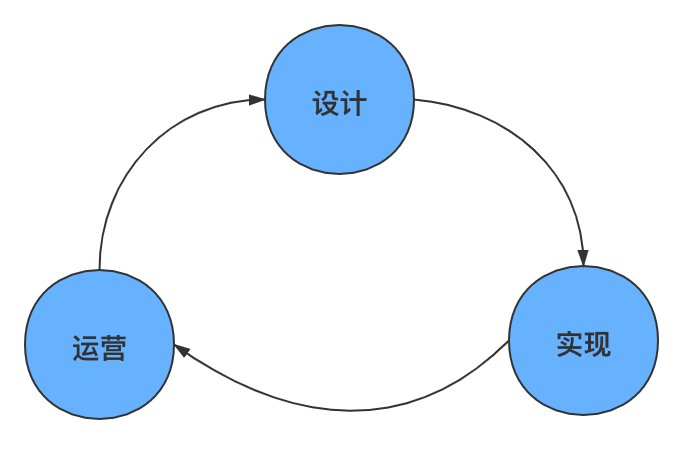

# 开环与闭环设计

## 闭环设计

---

## 开环设计

&emsp;&emsp;完成闭环设计后，整个系统开始进入平台期。所谓的平台期是整个系统的发展开始只围绕着闭环展开，需求来自于平台的自身，导致整个平台的演进反而受制于平台自身。
&emsp;&emsp;所以为了让系统具备更强的生命力，必须打破闭环即引入开环的思维设计。开环的设计思维可以有以下的几种方式：

- 横向比较，弥补系统短板。
  - 优点：平衡系统整体能力，将系统建设的更加强壮
  - 缺点：需要引入新的资源，频繁变化超出用户的接受能力
- 开源，引入社区资源。
  - 优点：借助社区的资源来寻找平台的不足
  - 缺点：社区的修改可能改变系统本身能力，与服务的用户冲突
- 建立生态，引入用户能力参与系统建设。
  - 优点：借助系统自身用户的改进和创新，引进到系统中，然后再推广给系统上其余用户
  - 缺点：在系统设计之初，就需要考虑如何在完成闭环的实现上，引入开环的切入点。比如通过插件，系统事件（trace point），封装系统能力（Open API）
