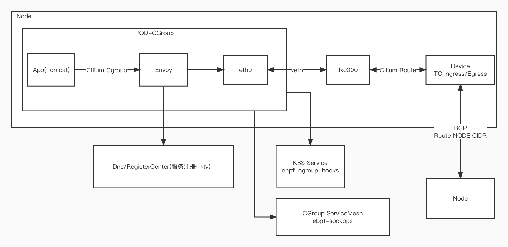

# cilium 中 Ebpf网络解决方案

---

## 容器内部网络

### cni解决方案

通过cilium-cni进行Node层面的虚拟网络设备分配。

## Node内部网络

### Ebpf 解决方案

在Node内部的网络，由Ebpf负责报文的投递。

**容器法网外部流量**，容器通过Veth pair和主机连通，目标网络的地址一般是另外Node作为网关的内部地址，主要是借助Linux Ebpf的TC Ingress和Egress能力，在虚拟设备上绑定TC

**外部发往容器流量**，

## 跨Node网络

### Calico解决方案

在跨Node之间的网络由Calico的路由方案解决报文路由问题。外部网络访问主机内部的网络，都转发至主机作为路由。
