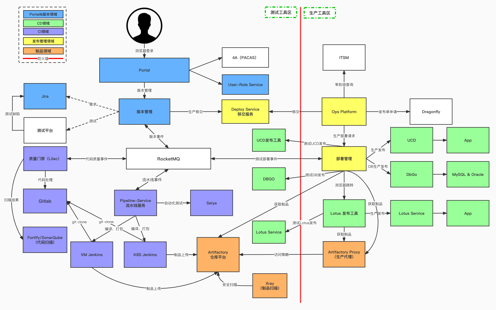

# DevOPS Arch

---

- DevOPS
  - 需求管理
  - 研发管理
  - 测试管理
    - dev，stg（fat00X），UAT，灰度，PRD
    - 测试 kick off（签发）
  - 部署管理
    - 测试部署
    - 生产移交
    - 生产部署
  - 交付验证
  - 效能量化
- DevSecOPS
  - 安全需求设计
    - 需求安全评审
  - 安全研发
    - 代码扫描
    - 组件扫描
    - 代码加固
  - 安全测试
    - 安全测试用例
    - DAST，*测试环境访问扫描*
    - IAST，*测试还访问信息收集*
  - 安全部署
    - RASP
    - WAF
