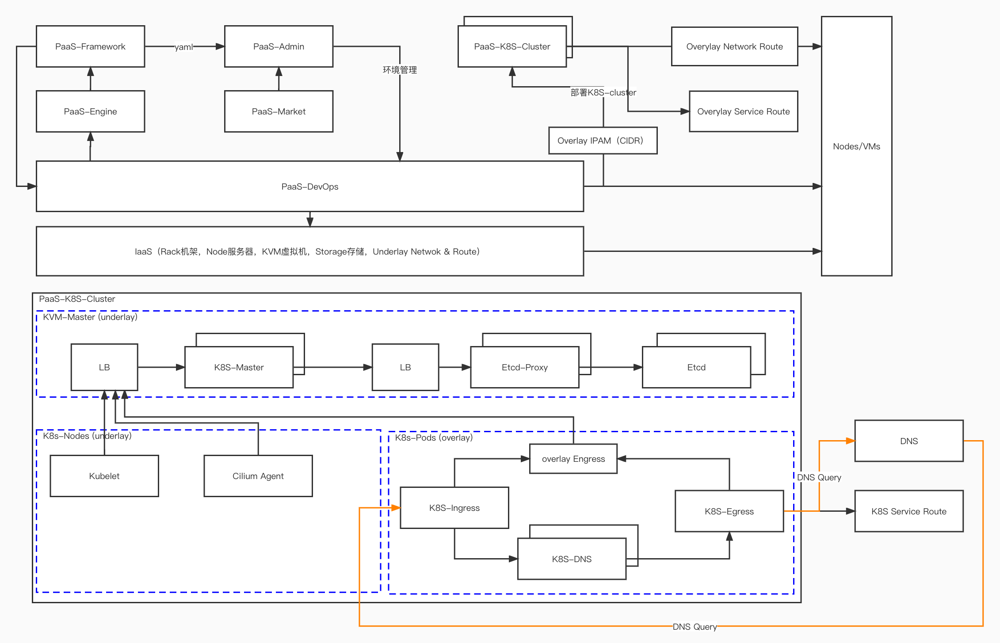

# PaaS K8S Arch

---

## 设计概要

### K8S Cluster

考虑单个K8S集群必然无法承担所有的企业的服务，更考虑到网络区域的划分，所以将K8S整体抽象成完整的Cluster，这个Cluster包含整个K8S所有必要的组件。

- ETCD，key-value server
  - ETCD Leader，Follower
  - ETCD Proxy

- Master，K8S的管理组件
  - API Server，*K8S的API服务*
  - Scheduler，*K8S的资源调度程序*
  - Controller Manager，*K8S的状态控制器*
    - Replication Controller
    - Node Controller
    - ResourceQuota Controller
    - Namespace Controller
    - Endpoint Controller
    - Service Controller
    - ServiceAccount Controller，*安全控制器*
    - Token Controller，*安全控制器*
  - ConfigMap

**ETCD Proxy**，为了提高ETCD的稳定性，可以通过Proxy+LB（F5）的方式将ETCD托管到K8S Cluster的外部，进行独立部署和管理。

**K8S Master LB（F5）**，通过LB将Master和API Server暴露给外部的K8S和应用

- K8S Node
  - Kubelet
  - K-operator

- K8S Network Solution
  - UnderLay（*IP可路由*）
    - bridge
    - PTP（*veth pair*）
    - IPVALN
    - MACVLAN
    - Calico（*三层解决方案*)
  - Overlay（*IP不可路由*）
    - Flannel（*Linux TUN解决方案*）
    - OVS(*bridge增强*)
      - OVN

### 虚拟网路设备

**Linux Bridge / OVS**，在Linux network stack 的二层net_recieve方法注册事件，然后过滤和封装数据报文。容器是通过veth pair连接到Node的bridge上进行数据投递，node 网络出口也必须连接到bridge才能跨node进行访问。

需要开启**IP Forward**具备IP报文转发功能，和**bridge hairpin**让Arp报文直接提交给交换机处理。因为报文

**linux TUN（二层）/ TAP（三层）**，通过在Linux Dev设备列表提供文件，将数据报文转化成对文件的读写。应用在用户态读写该文件后获取其他应用使用该虚拟网络设备发送和接受报文，然后再经过处理后通过实际网络设备投递到网络上。使用该虚拟网络设备的应用是看不到实际的网络设备的。

**Linux veth pair（PTP）**，该方案最简单，给每个容器分配veth，另外对应的veth对应存在在实际的网络环境中，然后将该veth对应的IP加入到网络层路由即可。该方案单个容许需要2个IP支持

**Linux IPVLAN & MACVLAN**，该解决方案是将本地的网卡进行虚拟分割。

### Calico

### 主机网卡BOND功能

将主机上多块网卡BOND在一起后，相当于单卡网卡提供网络能力，增强容错性，和传输性能。
